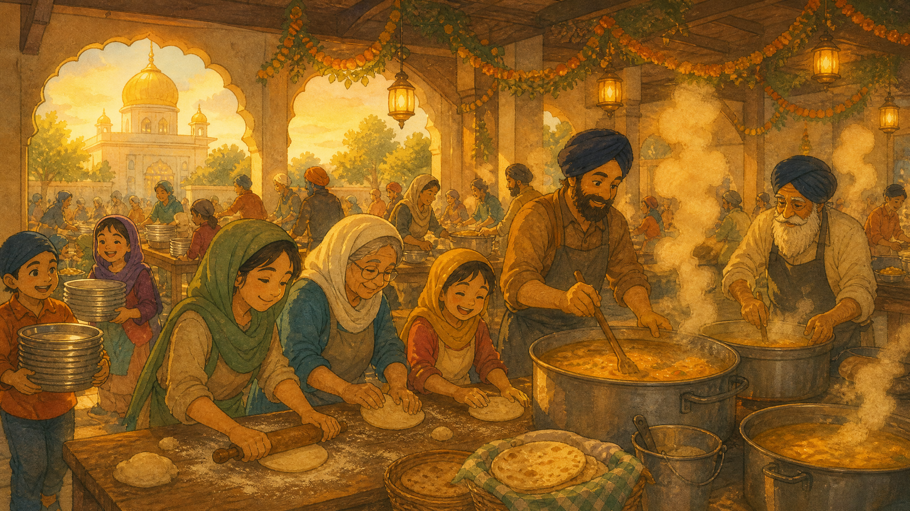
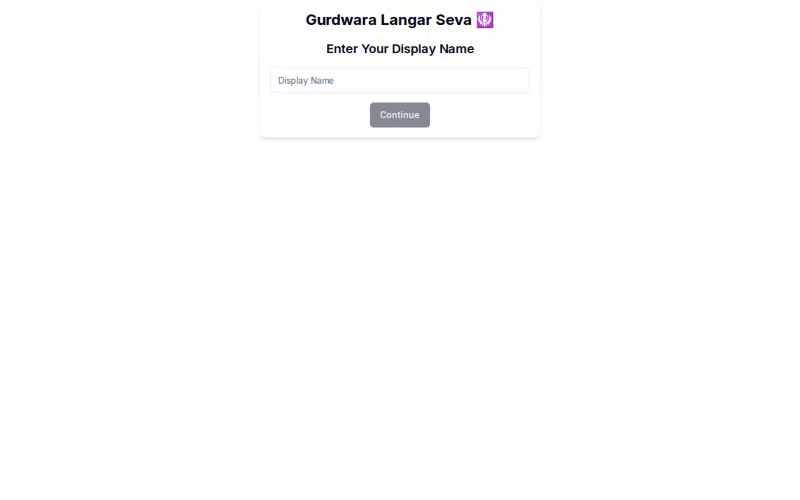

<div align="center">



# Gurduwara Langar Game

**A gentle, interactive introduction to Langar — the Sikh tradition of community kitchen, equality, and seva.** Built as a browser game for learning through play.

[](https://nextjs.org)
[](https://react.dev)
[](https://www.typescriptlang.org)
[](https://github.com/Ripnrip/GurduwaraLangarGame/releases)
[](LICENSE)
[](https://gurduwara-langar-game.vercel.app)

[**Play the live demo →**](https://gurduwara-langar-game.vercel.app)

</div>

---

## Why this exists

Langar is a community kitchen rooted in the Sikh principle that everyone should be welcomed, fed, and seated as equals. This project uses a small game loop rather than a lecture to introduce the tradition of **seva** — selfless service — and the social values behind it.

It is intentionally warm and approachable: a visitor can enter a name, choose an avatar, move through the gurdwara, and experience a lightweight learning flow that makes the idea memorable without claiming to be a substitute for community knowledge or practice.

## See it in motion

<div align="center">

</div>

## What is included

| Area | What it does |
|---|---|
| **Interactive game flow** | Guides a player through a simple, browser-based Langar experience. |
| **Cultural learning** | Introduces the values of service, equality, hospitality, and community care. |
| **Accessible web UI** | Uses a responsive React/Next.js interface designed to be approachable across devices. |
| **Lightweight persistence** | Includes Firebase integration points for application data; public client configuration belongs in environment variables rather than source control. |

## Run locally

Requires Node.js 18+ and npm.

```bash
git clone https://github.com/Ripnrip/GurduwaraLangarGame.git
cd GurduwaraLangarGame
npm install
npm run dev
```

Open <http://localhost:3000>.

Firebase initialization runs at application startup, so add a local `.env.local` file with your own Firebase web configuration before running or building:

```bash
NEXT_PUBLIC_FIREBASE_API_KEY=
NEXT_PUBLIC_FIREBASE_AUTH_DOMAIN=
NEXT_PUBLIC_FIREBASE_PROJECT_ID=
NEXT_PUBLIC_FIREBASE_STORAGE_BUCKET=
NEXT_PUBLIC_FIREBASE_MESSAGING_SENDER_ID=
NEXT_PUBLIC_FIREBASE_APP_ID=
```

> Values prefixed with `NEXT_PUBLIC_` are intentionally bundled into the browser. Use Firebase security rules and API-key restrictions; never place a server secret in these variables.

## Scripts

| Command | Purpose |
|---|---|
| `npm run dev` | Start the local Next.js development server. |
| `npm run build` | Create a production build. |
| `npm run start` | Serve the production build after `npm run build`. |

## Status

This is an educational, community-minded prototype. The core gameplay and live demonstration are public; feedback from Sikh community members should guide any expansion of its cultural content.

## License

MIT — see [LICENSE](LICENSE).

---

<div align="center">
<sub>Built by <a href="https://guriboycodes.com">Gurinder Singh</a> · <a href="https://github.com/Ripnrip">@Ripnrip</a></sub>
</div>
